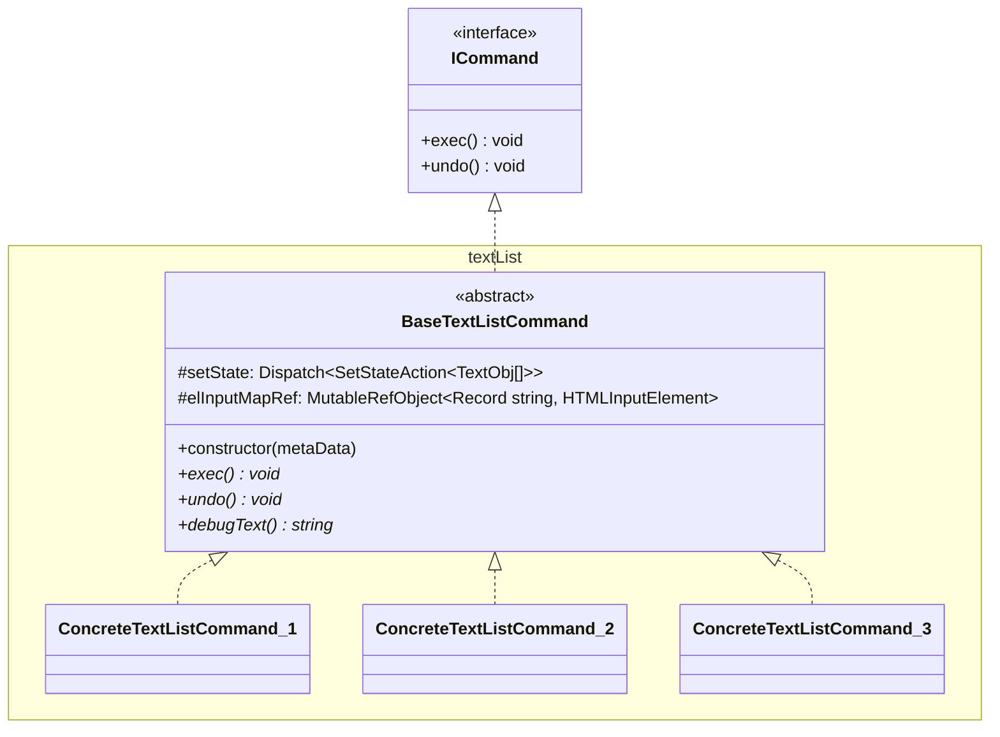

## 始めに

テキスト入力は標準でCmd+zまたはCtrl+zでundo(取り消し)ができますが、項目の追加や削除、並び替えを自前で実装した場合、何も対応しなければundoすることができません。ユーザ体験としては、全ての操作においてundoできた方が嬉しいと思うので、その方法について色々試してみましたので、記事にまとめました。

### 検証コード

今回は2パターンの方法で実装しました。一つ目は単純に状態を配列で管理する方法で、二つ目はコマンドパターンを使って操作履歴を管理する方法です。詳細は次のセクションから説明しますが、まず動きを見てみたい方はこちらを触っていただけたらと思います。

@[stackblitz](https://stackblitz.com/edit/vitejs-vite-cuf5tf?embed=1&file=src%2Fpages%2FSimpleHistoryPage.tsx&view=preview)

## 事前準備

### 検証用のテキストの追加・削除・並び替え機能の実装

まずは大前提となる履歴管理対象の検証用として、テキストの追加・削除・並び替え機能の実装をします。こちらは記事の本題に関わりのない部分なので実装方法については割愛しますので、詳細のコードが気になる方はStackBlitzの方でご参照してください。なお、並び替えの実装はこちらの記事を参考にしました。

https://zenn.dev/wintyo/articles/d39841c63cc9c9
https://zenn.dev/wintyo/articles/02ba90a93bff32

### チャンク単位で更新イベントを発火するテキスト入力コンポーネントの作成

次に状態を管理する前にテキスト入力の場合は一定のまとまりで変更が走るように調整します。Reactの場合、一文字ずつonChangeイベントが発火して更新しますが、これをするとundoを行なっても一文字ずつになってしまって使いづらくなってしまうためです。今回は以下の条件を満たした時に`onChangeValue`イベントを発火するようにしました。

- 日本語入力が確定した時（`onCompositionStart`してから`onCompositionEnd`するまで）
- 半角英数字入力時は、入力してから500ms経つまで

具体的にコードに落とすと以下のようなコードになりました。なお、状態をundo、redoの操作を自前で実装する必要があるので対象となるキーイベントはpreventDefaultして、Reactのコールバックとしてハンドリングできるようにしています。

```tsx:チャンク単位で更新イベントを発火するテキスト入力コンポーネント
import { FC, useState, useEffect, useRef, useMemo, Ref } from 'react';

export type InputHistoricalTextProps = {
  /** テキスト */
  value: string;
  /**
   * 取り消しイベント発行時
   */
  onUndo: () => void;
  /**
   * やり直しイベント発行時
   */
  onRedo: () => void;
  /**
   * 値変更時
   * @param newValue - 新しいテキスト
   */
  onChangeValue: (
    newValue: string
  ) => void;
};

export const InputHistoricalText: FC<InputHistoricalTextProps> = ({
  value,
  onUndo,
  onRedo,
  onChangeValue,
}) => {
  /** 日本語入力状態か */
  const isCompositedRef = useRef(false);

  const [localValue, setLocalValue] = useState(value);

  // 外部からの値とローカル値を同期する
  useEffect(() => {
    setLocalValue(value);
  }, [value]);

  // メモ化の対象から外すためにrefで持つ
  const onChangeValueRef = useRef(onChangeValue);
  onChangeValueRef.current = onChangeValue;

  /** イベント発火を一定時間遅らせる */
  const debouncedOnChangeValue = useMemo(() => {
    let timerId: number;

    return (newValue: string) => {
      clearTimeout(timerId);
      timerId = setTimeout(() => {
        onChangeValueRef.current(newValue);
      }, 500);
    };
  }, []);

  return (
    <input
      ref={inputRef}
      style={{ display: 'block', width: '100%' }}
      value={localValue}
      onCompositionStart={() => {
        isCompositedRef.current = true;
      }}
      onCompositionEnd={(event) => {
        isCompositedRef.current = false;
        onChangeValueRef.current(localValue);
      }}
      onKeyDown={(event) => {
        // Shift + Cmd + zでやり直し
        if (event.shiftKey && event.metaKey && event.key === 'z') {
          onRedo();
          event.preventDefault();
          event.stopPropagation();
          return;
        }
        // Cmd + zで取り消し
        if (event.metaKey && event.key === 'z') {
          onUndo();
          event.preventDefault();
          event.stopPropagation();
          return;
        }
      }}
      onChange={(event) => {
        setLocalValue(event.currentTarget.value);
        if (!isCompositedRef.current) {
          debouncedOnChangeValue(
            event.currentTarget.value,
            event.currentTarget.selectionStart
          );
        }
      }}
    />
  );
};
```

## 全ての状態を配列で管理する方法(Simple History)

まず一つ目の状態を復元させる方法としては、シンプルにその時その時の状態をマルっと持ってしまう方法です。その状態を配列で管理して参照したいindexを指定したらその時の状態を簡単に復元できます。
これをコードに落とすと以下のようになります。

```ts:状態を一括管理するhooks
import { useState, useCallback } from 'react';

export const useStateSimpleHistory = <T>(initialState: T) => {
  const [histories, setHistories] = useState([initialState]);
  const [currentIndex, setCurrentIndex] = useState(0);

  const pushState = useCallback(
    (newState: T) => {
      setHistories((prevHistories) => {
        const newHistories = [
          ...prevHistories.slice(0, currentIndex + 1),
          newState,
        ];
        setCurrentIndex(newHistories.length - 1);
        return newHistories;
      });
    },
    [currentIndex]
  );

  const setHistoryIndex = useCallback(
    (historyIndex: number) => {
      if (historyIndex < 0) {
        console.warn('負の値は設定できません。');
        return;
      }
      if (historyIndex >= histories.length) {
        console.warn('履歴以上のindexは設定できません。');
        return;
      }
      setCurrentIndex(historyIndex);
    },
    [histories.length]
  );

  const undo = useCallback(() => {
    setHistoryIndex(currentIndex - 1);
  }, [setHistoryIndex, currentIndex]);

  const redo = useCallback(() => {
    setHistoryIndex(currentIndex + 1);
  }, [setHistoryIndex, currentIndex]);

  return {
    histories,
    historyIndex: currentIndex,
    setHistoryIndex,
    currentState: histories[currentIndex],
    pushState,
    undo,
    redo,
  };
};
```

実際に動作を確認すると以下のようになります。右側に状態の履歴をリストで表示しており、undo/redoで表示する状態を前後に移動し、読み込むボタンを押すと直接その時の状態を復元できます。


単純な仕組みの割にやりたいことも果たせて結構良さそうですが、一つ問題があります。undoボタンを押しているときは気づきませんが、Cmd+zでundoしているとカーソル位置が末尾に戻される問題があります。（2番目のState履歴に戻った際は先頭の「今日も」という文字が消えたのでカーソル位置は先頭にあると嬉しい）


これはあくまでデータだけ持っていてカーソル位置まで保存していないためどうすることもできません。一応頑張れば`InputHistoricalText`コンポーネントのpropsのvalueが変わった際に変更されたテキストの位置を把握することでカーソル位置を調整できるかもしれませんが、期待する位置を正確に検出するのは難しいと思います。したがって、ここまで考慮する場合は次のセクションで説明するコマンドパターンで実装すると良いと思います。

## コマンドパターンで操作履歴を管理する方法(Command History)

二つ目の状態復元方法は、操作履歴を管理して、その操作を実行したり取り消したりすることでundo, redoを表現するやり方です。これはGoFのデザインパターンにも載っている手法になり、この辺が参考になります。

https://chan19.work/posts/%E3%83%87%E3%82%B6%E3%82%A4%E3%83%B3%E3%83%91%E3%82%BF%E3%83%BC%E3%83%B3%20%EF%BD%9ECommand%EF%BD%9E

https://zenn.dev/morinokami/books/learning-patterns-1/viewer/command-pattern

ただどの記事を見ても細かいところで微妙に実装方法が違っていて今回のケースにそのまま当てはめるのが難しかったのでReact用に少し調整して導入しています。
具体的には以下のようなクラス図のような構成にしました。コマンドパターンにも現れる超汎用的な実行と取り消しが行えるインターフェースとして`ICommand`を用意し、それをimplementsして今回のテキストリストに対応するベースのコマンドクラス(`BaseTextListCommand`)を定義しています。`BaseTextListCommand`ではコマンドから状態を更新するための`setState`メソッドを渡し、focusなどのDOM操作を行えるように各行のテキストに対応したinput要素をオブジェクト形式で持つようにしています(`elInputMapRef`)。更新メソッドをダイレクトに渡すことに少し抵抗はありましたが、そもそもコマンドパターンがキャンバスなどグローバルなものを直接操作することがほとんどで、その責任をコマンドクラスで持つものなので下手にReact側で最終コミットするとか考えずに完全に移譲させた方が良いと判断しました。
後はこの`BaseTextListCommand`から更に派生させて追加用だったり並び替え用だったりのコマンドクラスを実装して実際の操作を実現させます。



今回作ったコマンドは追加、更新、削除、並び替えの4つのコマンドで、具体的なコードは以下のようになります。数が多いので最初は折りたたみで表示しますので、詳細をみたい方は開いてご確認ください。

:::details AddTextListCommand

```ts:AddTextListCommand.ts
import { flushSync } from 'react-dom';

import { BaseTextListCommand, TextListMetaData } from './BaseTextListCommand';
import { TextObj } from '../../types/TextObj';

export class AddTextListCommand extends BaseTextListCommand {
  /** 新規追加するテキストオブジェクト */
  private newTextObj: TextObj;

  constructor(metaData: TextListMetaData, newTextObj: TextObj) {
    super(metaData);
    this.newTextObj = newTextObj;
  }

  exec() {
    flushSync(() => {
      this.setState((prevTextObjList) => {
        return [...prevTextObjList, this.newTextObj];
      });
    });

    const elInput = this.elInputMapRef.current[this.newTextObj.id];
    if (elInput != null) {
      elInput.focus();
    }
  }

  undo() {
    this.setState((prevTextObjList) => {
      return prevTextObjList.filter(
        (textObj) => textObj.id !== this.newTextObj.id
      );
    });
  }

  debugText() {
    return 'AddText: ' + JSON.stringify(this.newTextObj);
  }
}
```

:::

:::details UpdateTextListCommand

```ts:UpdateTextListCommand.ts
import { flushSync } from 'react-dom';
import { BaseTextListCommand, TextListMetaData } from './BaseTextListCommand';

import { TextObj } from '../../types/TextObj';

type CursorInfo = {
  /** 変更前のカーソル位置 */
  before: number | null;
  /** 変更後のカーソル位置 */
  after: number | null;
};

export class UpdateTextListCommand extends BaseTextListCommand {
  /** 更新するテキストオブジェクト */
  private renewTextObj: TextObj;
  /** カーソル位置情報 */
  private cursorInfo: CursorInfo;
  /** 更新前のテキストオブジェクト */
  private beforeTextObj: TextObj | null = null;

  constructor(
    metaData: TextListMetaData,
    renewTextObj: TextObj,
    cursorInfo: CursorInfo
  ) {
    super(metaData);
    this.renewTextObj = renewTextObj;
    this.cursorInfo = cursorInfo;
  }

  exec() {
    flushSync(() => {
      this.setState((prevTextObjList) => {
        const index = prevTextObjList.findIndex(
          (textObj) => textObj.id === this.renewTextObj.id
        );
        if (index < 0) {
          return prevTextObjList;
        }
        this.beforeTextObj = prevTextObjList[index];
        return [
          ...prevTextObjList.slice(0, index),
          this.renewTextObj,
          ...prevTextObjList.slice(index + 1),
        ];
      });
    });

    // 即時実行だとカーソル位置がずれてしまうのでワンテンポ遅れてから実行する
    setTimeout(() => {
      const elInput = this.elInputMapRef.current[this.renewTextObj.id];
      if (elInput != null) {
        elInput.focus();
        elInput.setSelectionRange(this.cursorInfo.after, this.cursorInfo.after);
      }
    });
  }

  undo() {
    if (this.beforeTextObj == null) {
      return;
    }
    const { beforeTextObj } = this;
    flushSync(() => {
      this.setState((prevTextObjList) => {
        const index = prevTextObjList.findIndex(
          (textObj) => textObj.id === beforeTextObj.id
        );
        if (index < 0) {
          return prevTextObjList;
        }
        const nextTextObjList = [
          ...prevTextObjList.slice(0, index),
          beforeTextObj,
          ...prevTextObjList.slice(index + 1),
        ];
        this.beforeTextObj = null;
        return nextTextObjList;
      });
    });

    // 即時実行だとカーソル位置がずれてしまうのでワンテンポ遅れてから実行する
    setTimeout(() => {
      const elInput = this.elInputMapRef.current[this.renewTextObj.id];
      if (elInput != null) {
        elInput.focus();
        elInput.setSelectionRange(
          this.cursorInfo.before,
          this.cursorInfo.before
        );
      }
    });
  }

  debugText() {
    return (
      'UpdateText: ' +
      JSON.stringify(this.renewTextObj) +
      ', ' +
      JSON.stringify(this.cursorInfo)
    );
  }
}
```

:::

:::details RemoveTextListCommand

```ts:RemoveTextListCommand.ts
import { flushSync } from 'react-dom';

import { BaseTextListCommand, TextListMetaData } from './BaseTextListCommand';
import { TextObj } from '../../types/TextObj';

export class RemoveTextListCommand extends BaseTextListCommand {
  /** 削除対象のテキストオブジェクトID */
  private targetTextObjId: string;
  /** 削除結果 */
  private removeResult: {
    /** 削除先のindex値 */
    removedIndex: number;
    /** 削除されたテキストオブジェクト */
    removedTextObj: TextObj;
  } | null = null;

  constructor(metaData: TextListMetaData, targetTextObjId: string) {
    super(metaData);
    this.targetTextObjId = targetTextObjId;
  }

  exec() {
    this.setState((prevTextObjList) => {
      const index = prevTextObjList.findIndex(
        (textObj) => textObj.id === this.targetTextObjId
      );
      if (index < 0) {
        return prevTextObjList;
      }
      this.removeResult = {
        removedIndex: index,
        removedTextObj: prevTextObjList[index],
      };
      return [
        ...prevTextObjList.slice(0, index),
        ...prevTextObjList.slice(index + 1),
      ];
    });
  }

  undo() {
    if (this.removeResult == null) {
      return;
    }
    const { removedIndex, removedTextObj } = this.removeResult;
    flushSync(() => {
      this.setState((prevTextObjList) => {
        const nextTextObjList = [
          ...prevTextObjList.slice(0, removedIndex),
          removedTextObj,
          ...prevTextObjList.slice(removedIndex),
        ];
        this.removeResult = null;
        return nextTextObjList;
      });
    });

    const elInput = this.elInputMapRef.current[removedTextObj.id];
    if (elInput != null) {
      elInput.focus();
    }
  }

  debugText() {
    return 'RemoveText: ' + this.targetTextObjId;
  }
}
```

:::

:::details SortTextListCommand

```ts:SortTextListCommand
import { BaseTextListCommand, TextListMetaData } from './BaseTextListCommand';
import { arrayMove } from '@dnd-kit/sortable';

export class SortTextListCommand extends BaseTextListCommand {
  /** 現在位置 */
  private fromIndex: number;
  /** 移動先の位置 */
  private toIndex: number;

  constructor(metaData: TextListMetaData, fromIndex: number, toIndex: number) {
    super(metaData);
    this.fromIndex = fromIndex;
    this.toIndex = toIndex;
  }

  exec() {
    this.setState((prevTextObjList) => {
      return arrayMove(prevTextObjList, this.fromIndex, this.toIndex);
    });
  }

  undo() {
    this.setState((prevTextObjList) => {
      return arrayMove(prevTextObjList, this.toIndex, this.fromIndex);
    });
  }

  debugText() {
    return 'SortText: ' + `${this.fromIndex} → ${this.toIndex}`;
  }
}
```

:::

今回は簡略のために`UpdateTextListCommand`と対象のテキストを一括更新するコマンドにしましたが、もっと正確にやる場合は何文字目から挿入する`InsertTextListCommand`と何文字目から何文字目から削除する`CutTextListCommand`を用意するとカーソル位置の指定がよりやりやすくなります。
今回はテキストを一括更新するやり方にしたため、カーソル位置情報も持っておく必要があるため、`InputHistoricalText`の`onChangeValue`でその情報も返すように調整しました。詳細をみたい方は開いて確認していただければと思います。

:::details onChangeValue時にカーソル位置も返すように調整

```diff tsx:onChangeValue時にカーソル位置も返すように調整
 export type InputHistoricalTextProps = {
+  /** 入力要素を参照するref */
+  inputRef?: Ref<HTMLInputElement>;
   /** テキスト */
   value: string;
   /**
    * 取り消しイベント発行時
    */
   onUndo: () => void;
   /**
    * やり直しイベント発行時
    */
   onRedo: () => void;
   /**
    * 値変更時
    * @param newValue - 新しいテキスト
+   * @param cursorInfo - カーソル位置情報
    */
   onChangeValue: (
     newValue: string,
+    cursorInfo: {
+      /** 変更前のカーソル位置 */
+      before: number | null;
+      /** 変更後のカーソル位置 */
+      after: number | null;
+    }
   ) => void;
 };

 export const InputHistoricalText: FC<InputHistoricalTextProps> = ({
+  inputRef,
   value,
   onUndo,
   onRedo,
   onChangeValue,
 }) => {
   /** 日本語入力状態か */
   const isCompositedRef = useRef(false);
+  /** 入力開始時のcursor位置 */
+  const startCursorIndexRef = useRef<number | null>(null);
+  /** 入力中か */
+  const isInputingRef = useRef<boolean>(false);

   const [localValue, setLocalValue] = useState(value);

   // 外部からの値とローカル値を同期する
   useEffect(() => {
     setLocalValue(value);
+    startCursorIndexRef.current = null;
+    isInputingRef.current = false;
   }, [value]);

   // メモ化の対象から外すためにrefで持つ
   const onChangeValueRef = useRef(onChangeValue);
   onChangeValueRef.current = onChangeValue;

   /** イベント発火を一定時間遅らせる */
   const debouncedOnChangeValue = useMemo(() => {
     let timerId: number;

     return (newValue: string, newCursorIndex: number | null) => {
       clearTimeout(timerId);
       timerId = setTimeout(() => {
         onChangeValueRef.current(newValue, {
+          before: startCursorIndexRef.current,
+          after: newCursorIndex,
         });
       }, 500);
     };
   }, []);

   return (
     <input
       ref={inputRef}
       style={{ display: 'block', width: '100%' }}
       value={localValue}
       onCompositionStart={() => {
         isCompositedRef.current = true;
       }}
       onCompositionEnd={(event) => {
         isCompositedRef.current = false;
         onChangeValueRef.current(localValue, {
+          before: startCursorIndexRef.current,
+          after: event.currentTarget.selectionEnd,
         });
       }}
       onKeyDown={(event) => {
         // Shift + Cmd + zでやり直し
         if (event.shiftKey && event.metaKey && event.key === 'z') {
           onRedo();
           event.preventDefault();
           event.stopPropagation();
           return;
         }
         // Cmd + zで取り消し
         if (event.metaKey && event.key === 'z') {
           onUndo();
           event.preventDefault();
           event.stopPropagation();
           return;
         }
+        if (!isInputingRef.current) {
+          startCursorIndexRef.current = event.currentTarget.selectionStart;
+        }
       }}
       onChange={(event) => {
+        isInputingRef.current = true;
         setLocalValue(event.currentTarget.value);
         if (!isCompositedRef.current) {
           debouncedOnChangeValue(
             event.currentTarget.value,
+            event.currentTarget.selectionStart
           );
         }
       }}
     />
   );
 };
```

:::

最後にコマンドの実行を管理するhooksを実装します。

```ts:コマンドの実行を管理するhooks
import { useState } from 'react';

import { ICommand } from '../commands/ICommand';

export const useCommandManager = <Command extends ICommand = ICommand>() => {
  const [commands, setCommands] = useState<Command[]>([]);
  const [commandIndex, setCommandIndex] = useState<number | null>(null);

  return {
    commands,
    commandIndex,
    execCommand: (command: Command) => {
      command.exec();
      const nextCommandIndex = commandIndex == null ? 0 : commandIndex + 1;
      setCommands((prevCommands) => [
        ...prevCommands.slice(0, nextCommandIndex),
        command,
      ]);
      setCommandIndex(nextCommandIndex);
    },
    undo: () => {
      if (commandIndex == null) {
        return;
      }
      const currentCommand = commands[commandIndex];
      currentCommand?.undo();
      setCommandIndex(commandIndex > 0 ? commandIndex - 1 : null);
    },
    redo: () => {
      const nextCommandIndex = commandIndex == null ? 0 : commandIndex + 1;
      const nextCommand = commands[nextCommandIndex];
      if (nextCommand == null) {
        return;
      }
      nextCommand.exec();
      setCommandIndex(nextCommandIndex);
    },
  };
};
```

このhooksを使って、各操作をコマンドを発行して実行するやり方にすると以下のような動作になりました。SimpleHistoryで気になっていたカーソル位置も復元できました😄


## 終わりに

以上が状態を復元する機能をhooksを使って実装する方法でした。今回の例ではテキスト入力が絡むことでかなり苦労しましたが、テキスト入力なしの追加削除、並び変えのみの場合はSimpleHistoryのやり方で十分ではあるので、意外と楽に実装できるなと思いました😄 DOMの操作も絡む場合はコマンドパターンにすることでより詳細なハンドリングが可能になりますが、Reactとの棲み分けで結構苦労しました。今回の`UpdateTextListCommand`でカーソル位置を調整する方法もReact側からのHTML操作によって上手く指定できずsetTimeoutでタイミングをずらすという逃げをしましたが、思い切ってinput要素もvalueを渡さず完全にuncontrollableにしてコマンドクラスからのみ操作するという作りにした方がもしかしたら良いのかなと思いました🤔
Reactで状態を復元する実装をする時の参考になれれば幸いです。
